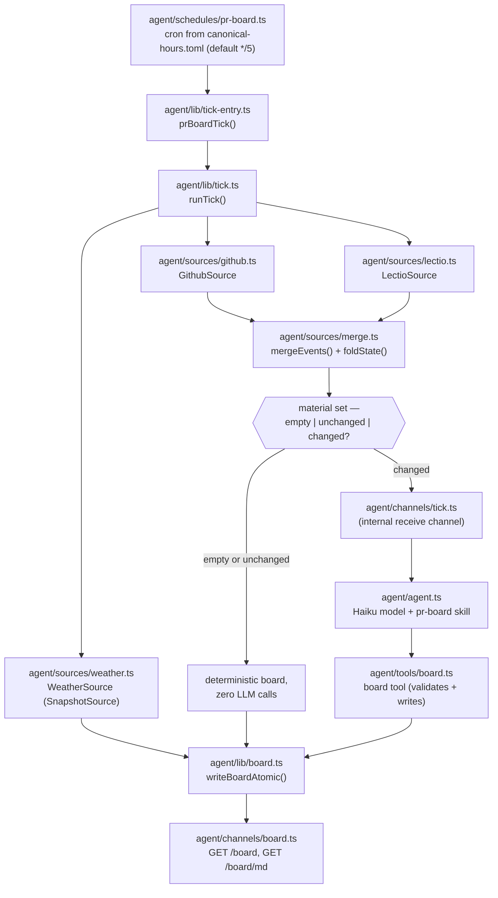
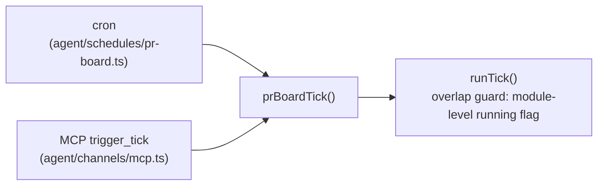

# Architecture

canonical-hours is a scheduled [eve.dev](https://eve.dev) agent: a
cron tick (cadence from `canonical-hours.toml`, default every 5
minutes) that fetches authored-PR activity from two sources, merges and
folds it into a four-state lifecycle, attaches current-value snapshots
(weather), and — only when the material set actually *changed* —
invokes a Haiku model to triage and write a status board. If you're
trying to *run* it, start at
[../README.md](../README.md). This document covers what actually runs,
why it's built the way it is, and what's proven vs. still unverified.

## What runs



- **`agent/agent.ts`** — the standing agent definition: Haiku
  (`claude-haiku-4-5`) via the direct `@ai-sdk/anthropic` provider
  (bypassing Vercel AI Gateway), eve's default local/file workflow
  world, and a sandbox backend selected at runtime by
  `agent/sandbox.ts` (`SANDBOX_BACKEND=docker|vercel|auto`, env-driven
  so the same code runs against a local Docker daemon or Vercel
  Sandbox without a rebuild).
- **`agent/schedules/pr-board.ts`** — the cron entry point (cadence read
  from `loadConfig()` at module load). It does nothing but call
  `waitUntil(prBoardTick(...))`, forwarding the schedule handler's own
  `receive`/`appAuth`.
- **`agent/lib/tick.ts`** (`runTick`) — the deterministic core: fetch
  from every source independently, merge, fold, decide whether the tick
  is material, and either write a templated board directly or hand off
  to the agent. Never throws out of `runTick` itself — a failing source
  becomes a degradation entry, not a crash.
- **`agent/lib/config.ts`** — `loadConfig()`: synchronous parse +
  zod-validation of the committed, non-secret `canonical-hours.toml`
  (`[schedule] cron`, `[weather] location`). Missing file → defaults
  (5-minute cron, no weather source registered); malformed file →
  throws at module load. Secrets never live here — `WEATHER_API_KEY`
  stays in env, exactly like `GITHUB_TOKEN`.
- **`agent/sources/snapshot.ts` / `agent/sources/weather.ts`** — the
  `SnapshotSource` protocol (three members: `name`, `fetch()`,
  `freshness()`) and its first implementation. Snapshots are
  current-value readings with no window, no lifecycle, and no LLM
  involvement; they never enter `mergeEvents`/`foldState` and never
  appear in `AgentTickInput`.
- **`agent/channels/tick.ts`** — an internal-only channel (`routes: []`,
  unreachable over HTTP) that exists solely so the tick can `receive()`
  the Haiku agent and *block until the agent's turn has actually
  settled* — it reads the session's event stream for
  `session.completed`/`session.failed` rather than trusting that
  `receive()`'s returned promise resolves at turn-completion (see
  `docs/eve-api-notes.md` fact 2 for why that trust would have been
  premature).
- **`agent/tools/board.ts`** — the only write surface the LLM has. It
  validates the model's board against the zod schema and stamps
  `generated_at` itself (never trusting the model's clock) before
  writing.
- **`agent/lib/board.ts`** — the board's zod contract
  (`BoardSchema`/`BoardPrSchema`), the markdown renderer, and
  `writeBoardAtomic()` (write-to-temp, then `rename` — a poll never
  observes a half-written `board.json`).
- **`agent/channels/board.ts`** — the read surface: `GET /board`
  (JSON) and `GET /board/md` (rendered markdown), both backed by
  `readBoard()`.
- **`agent/channels/mcp.ts`** — the protocol-conformant surface: a
  streamable-HTTP MCP endpoint at `POST /mcp` exposing `get_board`
  (backed by the same `readBoard()`/`renderBoardMd()` as the REST
  routes above), `trigger_tick` (calls `prBoardTick()` directly, the
  same entry point `agent/schedules/pr-board.ts` calls), and two opt-in
  action tools — `resolve_addressed_review_threads` and
  `dismiss_stale_bot_reviews` — that mutate GitHub on explicit call and
  are never fired from the automatic tick. See
  [The MCP surface](#the-mcp-surface) below.

For the eve-specific API facts behind these choices (schedule/channel
shapes, the `receive()` blocking guarantee, sandbox backend imports,
the `/board` vs `/board.json` route-naming constraint), see
[eve-api-notes.md](eve-api-notes.md) — those are implementation
citations, not repeated here.

## The pluggable Source protocol

Before the tick, before the merge logic, there's a design decision that
shapes everything downstream: lectio and GitHub aren't hardcoded into
the pipeline, they're two implementations of one small interface
(`agent/sources/source.ts`). This was deliberate — the explicit ask
going in was "make it pluggable," scoped narrowly: a real interface
other adapters could implement, but *local to this repo*, not a
cross-project standard other repos are meant to adopt (that's a
possible future lectio enhancement, not this repo's job — see
`docs/lectio-api-notes.md`).

```ts
interface Source {
  name: string;
  schema: z.ZodType;                          // one raw provider record
  fetch(window: FetchWindow): Promise<unknown[]>;
  mapToLifecycleEvent(raw: unknown): LifecycleEvent;
  freshness(): Promise<string | null>;
}
```

Three things make this work as a real abstraction rather than a
thin wrapper around two special cases:

- **The shared vocabulary lives above the adapters, not inside them.**
  `Artifact` (a canonical URI + kind — `pr:owner/repo#123`), `Observation`
  (a timestamped fact with a `classification` of `hard` or `soft`), and
  the four-state `LifecycleState` enum (`opened` / `active` / `needs_you`
  / `resolved`) are all defined once, in `source.ts`, and every adapter
  normalizes into that shape. Nothing downstream of `mapToLifecycleEvent`
  ever sees a lectio- or GitHub-specific field.
- **Priority policy is a merge-time concern, not an adapter concern.**
  "GitHub is the sole hard source, lectio fills enrichment, hard beats
  soft on conflict" is a rule `agent/sources/merge.ts` applies across
  *whichever* sources are registered — it's not encoded in either
  adapter. `sources/lectio.ts` and `sources/github.ts` don't know about
  each other or their relative priority; they just each answer "what do
  you see, and how sure are you." That's what makes the earlier claim —
  "a third source later is a registry entry, not a rewrite" — actually
  true rather than aspirational: a hypothetical third adapter (Linear,
  say) would implement the same three methods, get added to the
  `priority` list `agent/lib/tick-entry.ts` passes into `runTick`, and
  everything from `mergeEvents` onward would handle it with zero
  changes.
- **Each adapter owns its own failure boundary.** `schema` is what makes
  "fail loudly, not silently" enforceable per-source: a provider
  response that doesn't parse throws inside that adapter's own
  `fetch`/`mapToLifecycleEvent`, gets caught by `runTick`'s per-source
  `try/catch`, and becomes one `degradations` entry — never a crash,
  never silent corruption of the merged view.

**Adding a new source** means: write a module implementing `Source`
(a zod schema for the provider's raw shape, a `fetch` that returns raw
records for a window, a `mapToLifecycleEvent` that normalizes into the
shared vocabulary, a `freshness` check), register it in the `priority`
array where lectio/GitHub are registered today, and — this is the part
that proves the abstraction — touch nothing in `merge.ts`, `board.ts`,
or `tick.ts`. If adding a source ever requires editing those files, the
abstraction has leaked and that's worth noticing, not working around.

The two live adapters are asymmetric on purpose, which is itself worth
understanding as a design choice rather than an inconsistency: lectio
(`sources/lectio.ts`) is soft-only — discovered mid-build that its
`memory_authored_activity` tool has no way to expose a review's verdict,
only that something happened (see `docs/lectio-api-notes.md`) — while
GitHub (`sources/github.ts`) is the sole producer of `hard`
classifications. A future adapter isn't obligated to pick a side; the
protocol doesn't care whether a source ever emits `hard` observations,
only that it's honest about which it's asserting.

## The second source kind: snapshots

The board now carries two kinds of sources. Activity-fold sources are
the `Source` protocol above, untouched. **Snapshot sources**
(`agent/sources/snapshot.ts`) are deliberately smaller — a name, a
`fetch(): Promise<SnapshotValue>`, a `freshness()` — because a
current-value reading has no window and no lifecycle to fold. The two
interfaces are separate on purpose: a unified discriminated union would
force snapshot sources to fake a `FetchWindow` and grow a branch in
every downstream consumer, reintroducing exactly the source-specific
leakage the existing protocol avoids.

The load-bearing rule: **snapshots never touch the LLM path.** There is
no judgment call in "it's 72°F." They are fetched deterministically on
every tick (each in its own try/catch — a failure is that source's
`degradations` entry with `since` carried forward, identical to
activity sources) and stamped by `runTick` onto whichever board gets
written, on every outcome — entirely outside `AgentTickInput`,
`agentPrompt`, and the agent's instructions. A snapshot source that
seems to need summarization is not a snapshot source — it's an
activity source or out of scope.

The registry invariant extends to the new kind: adding a second
snapshot source is a new `agent/sources/*.ts` module plus one entry in
`tick-entry.ts`'s `snapshotSources` array. If it ever requires editing
`tick.ts` or the agent's instructions, the abstraction has leaked.

## Data flow: one tick

1. **Fetch.** `runTick` calls `fetch(window)` on each configured
   `Source` (`agent/sources/source.ts`'s protocol) independently, inside
   its own try/catch. `window` is always `{ since: now - 72h, until:
   now }` — see [Why stateless](#why-stateless-a-72h-window-not-a-cursor)
   below. A source that throws becomes a `degradations` entry (with the
   *original* failure timestamp preserved across ticks via the previous
   board, not reset every tick); it does not stop the other source or
   abort the tick.
2. **Fetch (snapshots).** In the same loop structure, each
   `SnapshotSource.fetch()` runs in its own try/catch — success joins
   this tick's `snapshots` array (and its `freshness()` joins
   `freshness`); failure becomes a `degradations` entry with `since`
   carried forward. No window is passed — snapshots are current-value
   by definition.
3. **Normalize.** Each raw record is parsed against the adapter's own
   zod schema and mapped to a `LifecycleEvent` (one `Artifact` + its
   `Observation[]`). Schema drift throws loudly here, which becomes that
   source's degradation — not a silently wrong board.
4. **Merge + fold** (`agent/sources/merge.ts`). `mergeEvents()` dedupes
   observations across sources by canonical artifact URI
   (`pr:owner/repo#N`) under a priority list (`["lectio", "github"]`)
   with one override: **a hard observation always replaces a soft one**,
   regardless of source priority. `foldState()` then reduces one
   artifact's full observation history to a single lifecycle state —
   see [the worked example](#worked-example-one-pr-through-the-pipeline)
   below for the exact rule order.
5. **Decide materiality — three-way.** `runTick` computes the material
   set and `computeMaterialHash(material)` — sorted
   `(artifact_uri, state, observation-set-identity)` tuples, SHA-256,
   where the observation-set identity covers every observation's
   `(at, type)`, not just the latest timestamp (the tick is stateless
   and re-fetches the whole window every time, so a new observation
   isn't guaranteed to advance the max timestamp). Empty
   set → **all_clear**: templated board, zero LLM. Hash equal to the
   previous board's `material_hash` (and the previous board was not an
   agent-fallback board — a `degradations` entry with source `"agent"`
   means the agent is retried so summaries recover after an outage) →
   **material_unchanged**: a deterministic board with fresh
   `generated_at`/window/freshness/degradations/snapshots, `prs`
   rebuilt from this tick's own fold with only the LLM-authored
   `summary` carried over per `artifact_uri`, zero LLM. Otherwise →
   **material**, today's agent path; after the agent's board passes the
   freshness check, `runTick` rewrites it once with the
   runtime-authoritative `snapshots` + `material_hash` overlaid (the
   model is never trusted for either field — same principle as the
   board tool's `generated_at` stamp).
6. **Material tick.** In the `material` case, `runTick` calls
   `invokeAgent()` (built by `createInvokeAgent` in
   `agent/lib/invoke-agent.ts`), which `receive()`s the merged material
   into the internal tick channel. The Haiku agent, guided by
   `agent/instructions.md` and the
   [`pr-board` skill](../agent/skills/pr-board/SKILL.md), triages and
   summarizes, then calls the `board` tool exactly once. `runTick`
   re-reads the board after the agent's turn settles; if it's not fresh
   (or the agent never produced a valid board), it retries once, then
   falls back to a deterministic degraded board carrying the
   un-summarized events — the LLM's absence degrades the *quality* of
   the board, never its existence.

## The MCP surface

Everything above this point is reachable two ways: the REST-shaped
routes in `agent/channels/board.ts`/`tick.ts` (curl, humans, anything
that just wants JSON or markdown over plain HTTP), and, additively, a
real [MCP](https://modelcontextprotocol.io) server at `agent/channels/mcp.ts`.
The REST routes aren't going anywhere — the MCP surface exists because
canonical-hours is meant to be the general home for scheduled,
repeatable agent tasks, not a PR-board-specific tool, and that class of
capability needs to be consumable by other *agent* infrastructure, not
just by whoever's willing to `curl` and parse JSON by hand. The
concrete driver is [cloister](../cloister) — a v8-isolate hypervisor
that bundles a set of MCP servers behind one endpoint for its own
agents to call — which only knows how to consume MCP, not arbitrary
REST shapes.

### The tools and the tick guard

Only `trigger_tick` (and the cron) reach `runTick`; the two action tools
mutate GitHub directly and never enter this path.



- **`get_board`** (read-only) — calls the same `readBoard()` /
  `renderBoardMd()` the REST routes use. Returns the full board as
  structured content (typed by the existing `BoardSchema`) plus the
  rendered markdown as text, so a model-side MCP caller gets a
  zero-parsing render without losing the structured shape a
  programmatic caller needs. `board: null` (no tick has ever completed)
  is a successful result, not an error — the MCP analog of
  `board.ts`'s `404 {"error":"no board yet"}`.
- **`trigger_tick`** (action) — calls `prBoardTick()` directly, the
  identical entry point the cron schedule calls, and awaits the real
  six-way `TickResult` (`skipped_overlap`, `skipped_quiet`, `all_clear`,
  `material_unchanged`, `material`, `degraded_fallback`) rather than
  firing-and-forgetting. This is a second *trigger* for the same tick
  logic, not a separate code path — `agent/lib/tick.ts`, `board.ts`,
  and the cron schedule are untouched.
- **`resolve_addressed_review_threads`** (action) and
  **`dismiss_stale_bot_reviews`** (action) — the two mutating tools,
  covered in [Action tools and merge_ready](#action-tools-and-merge_ready)
  below. Both are strictly opt-in: they mutate GitHub only when a caller
  invokes them explicitly, and **neither is ever reachable from
  `runTick`** — same trust boundary as `trigger_tick`, not the automatic
  tick's.

The load-bearing property that makes a second trigger safe with zero
new concurrency code: the in-process overlap guard
(`agent/lib/tick.ts`'s module-level `running` flag, see
[What's verified](#whats-verified-and-whats-not)) is already
trigger-source-agnostic — it doesn't know or care whether the caller
was the cron schedule or an MCP client, only that at most one tick runs
at a time in this process. If `trigger_tick` arrives while a cron-fired
tick is mid-flight, `runTick()` returns `skipped_overlap` immediately,
before any fetch or write — and the MCP tool surfaces that as a
**successful** result (`isError` unset), not a failure: an overlapping
tick is a defined, healthy outcome already first-class in the
`TickResult` union, and the board still gets refreshed by whichever
tick is actually running. The same guard protects the mirror case (a
cron tick landing mid-MCP-tick) and two concurrent MCP calls, for the
same reason.

### Action tools and merge_ready

The board and the two action tools fold in the mechanical CI/review
signals ported from
[`watch-pr.md`](../../rosary/agents/skills/watch-pr.md) — deterministic
merge-readiness reporting plus its two mutating behaviors — without
adding any new LLM or judgment surface, and without either mutation ever
firing from the tick.

**`merge_ready`** is a derived, per-PR boolean on the board
(`BoardPrSchema.merge_ready`). It is `true` iff all three of
`watch-pr.md` §3's explicit conditions hold: `reviewDecision` is
`APPROVED` *or* `null` (null = the repo requires no review), there are
no failing branch-protection-*required* checks, and there are no
unresolved review threads. It is deliberately **derived, not folded**:
it is computed in `GithubSource.mapToLifecycleEvent` from
`reviewDecision` + the required-check rollup + the unresolved-thread
list and passed through to the board via a new `extra` bag on
`LifecycleEvent`/`MergedArtifact` — it introduces **no new
`LifecycleState`, no new `Observation` type, and no `foldState`
change**. It is intentionally *not* GitHub's own broader
`mergeStateStatus` (fetched for visibility only), because that field
also folds in merge-conflict state that `watch-pr`'s three-condition
rule does not consider.

**`resolve_addressed_review_threads`** (`agent/lib/thread-resolution.ts`)
resolves an unresolved review thread iff its file was changed in a
commit that landed *after* the thread's originating review — the
mechanical eligibility from `watch-pr.md` §2c, no judgment call.
**`dismiss_stale_bot_reviews`** (`agent/lib/bot-review-dismissal.ts`)
dismisses a `CHANGES_REQUESTED` review from a bot account iff a fix
commit landed after it (§2d). Bot detection is the GraphQL author's
`__typename === "Bot"` *or* a `[bot]`-suffixed login — **never** a bare
`-bot` suffix, which would collide with human usernames (`watch-pr.md`'s
own explicit warning). Both tools continue past an individual mutation
failure — a failing `resolveReviewThread`/`dismissPullRequestReview`
is recorded in the result's `failed` array and the run moves to the next
thread/review rather than aborting — and both return a
`{ resolved|dismissed, skipped, failed }` structured result.

**GraphQL vs. REST split.** Both libraries read thread/review state and
perform their mutations over GraphQL (`reviewThreads`/`reviews`,
`resolveReviewThread`/`dismissPullRequestReview`), through the shared
stateless `graphqlPost` helper in `agent/lib/github-graphql.ts`. The one
thing they reach for REST is the per-commit changed-file listing
(`GET /repos/{owner}/{repo}/pulls/{n}/commits` then
`GET /repos/{owner}/{repo}/commits/{sha}` for each commit's `files[]`) —
GraphQL exposes no clean equivalent for a commit's changed-file set,
which the "was this thread's file touched after the review" eligibility
check needs. Both tools take their target PR as a call argument
(`owner/repo#123` or a github.com PR URL, parsed by
`agent/lib/pr-ref.ts`) and reuse `process.env.GITHUB_TOKEN` exactly as
the tick already does — no new config surface.

### Transport

Streamable-HTTP, mounted as a custom channel the same way `board.ts`
and `tick.ts` are — a `POST /mcp` route builds a fresh `McpServer` +
stateless transport per request and hands it the incoming `Request`.
`/mcp` is deliberately extensionless: dotted custom-channel paths fail
the Nitro build (the same constraint that shaped `/board`/`/board/md`
instead of `/board.json`; see [eve-api-notes.md](eve-api-notes.md)
§3). The server runs **stateless JSON mode** — no SSE session stream —
because neither tool needs one: `get_board` and `trigger_tick` are
both single-request/single-response, and per-request `McpServer`
construction needs no session affinity across calls. `GET /mcp`
returns `405` deliberately; there is no stream to open in this mode.

### `server.json` and tenancy

`server.json` at the repo root is the MCP registry document — the
shape a `cloister add` (or any MCP client's registration flow)
resolves. It declares:

- `name`/`title`/`description` identifying the server and what it does.
- A `remotes` entry of type `streamable-http` pointing at `/mcp`, with
  the port as a `variables` default (`2000`, eve's observed dev port —
  see [eve-api-notes.md](eve-api-notes.md) §3) so an operator overrides
  it per deployment rather than the document hardcoding one.
- `_meta."art.cloister/v1".tenancy.default_mode: "external"`,
  `trusted_tier: false`. This is a structural default, not a policy
  preference: canonical-hours runs on Node via eve — it depends on
  Node builtins and npm packages that aren't v8-isolate/Workers
  compatible — so it cannot be co-located inside cloister's workerd
  sandbox, and `external`/untrusted is the correct default for a
  standing Node process cloister only ever reaches over the network,
  per cloister's own tenancy docs. No `groups` partitioning is
  declared — this small tool set doesn't need splitting into separate
  cloister backends, and cloister's resolver falls back to one coarse
  backend for exactly this case.

### Pointing a client at it

For local development, `server.json`'s `remotes[0].url` resolves to
`http://localhost:2000/mcp` against `eve dev`'s default port — any MCP
client (cloister's registration flow, or a bare
`StreamableHTTPClientTransport` from `@modelcontextprotocol/sdk`) can
connect directly. For a real deployment, register the deployed
`server.json` with cloister (`cloister add` or equivalent), overriding
the `port` variable — or the whole `remotes[0].url` — to the actual
host. Nothing about the tools themselves changes between local and
deployed; only the address a client dials.

## Design decisions

### Why GitHub is the sole hard-verdict source

This wasn't a design assumption — it was discovered mid-build via a
live MCP call and corrected. lectio's `memory_authored_activity` tool
projects each new item as `{ kind: "github/review" |
"github/review_comment", author, path, preview, observed_at_nanos }`.
`kind` names the *artifact type*, never the review's outcome. Reading
lectio's own adapter source (`gh.rs:394`) confirms the verdict
(`Approved` / `ChangesRequested` / `Commented`) *is* captured when
lectio ingests a review — but `authored.rs`'s projection into
`memory_authored_activity`'s response (lines 223–229) never forwards
it. There is no way, from this tool, to tell "approved" from "changes
requested" from "commented" — only "a review happened."

Consequently `agent/sources/lectio.ts`'s `classifyLectioKind()` is a
constant function: every lectio-sourced observation is `soft`, and
`mapToLifecycleEvent()` never claims a state stronger than `"active"`
(never `needs_you`, never `resolved`) on lectio's word alone.
`agent/sources/github.ts`, reading the same event straight from
GitHub's GraphQL API (`PullRequest.reviews`, which *does* return
`state`), classifies every observation it emits — review verdicts,
comments, merges, closes — as `hard`. The full citation trail (Rust
line numbers, the live call's raw JSON) is in
[lectio-api-notes.md](lectio-api-notes.md); this section is the "so
what," not the evidence.

The practical effect, enforced in `mergeEvents()`
(`agent/sources/merge.ts:104`): when lectio and GitHub both observe the
same event, a hard GitHub observation always overwrites a soft lectio
one at merge time, even though lectio is earlier in the source
priority list for *deduplication* purposes. Priority order picks a
winner among equal-classification duplicates; classification always
wins the state question.

### GitHub: GraphQL, required-check visibility, and configurable backoff

`agent/sources/github.ts` speaks GraphQL, not REST. `fetch()` issues a
small, bounded number of `POST https://api.github.com/graphql` requests
per tick — 2 in the common case (the windowed search and the backstop
search, each batching `viewer{login}`, the search itself, and every
matched PR's reviews/comments/check-conclusions/`rateLimit` into one
round trip), plus one *conditional* third request, only when at least
one PR has an actual failing check, resolving which of those checks
are branch-protection-*required*. That third request is unavoidable:
GitHub's GraphQL schema requires `CheckRun.isRequired`/
`StatusContext.isRequired` to take an explicit `pullRequestNumber`
argument — it cannot be resolved inside the batched `search` query
even when nested under a specific `PullRequest` node, confirmed by
querying GitHub's real schema directly. The workaround is an aliased,
literal-PR-number-per-block second query. That aliasing is keyed by
**array index** (`pr0`, `pr1`, ...), not by PR number — this source
fetches the viewer's own PRs across every repo they've touched, where
identical PR numbers across different repos are routine (every repo
has a `#1`), and aliasing by number alone would emit a duplicate
GraphQL alias whenever two same-numbered PRs from different repos
both had a failing check in one tick, which GitHub's API rejects
outright, failing the whole request.

A failing **required** check surfaces the same way the existing
"standing changes_requested" backstop already does: `mapToLifecycleEvent`
sets `state_hint: "needs_you"`, reusing the exact mechanism rather than
adding a new `foldState` branch (which stays completely untouched by
any of this). It also emits a `check_failed` observation (hard
classification, carrying the check name) purely so the board shows
*why* — a line item visible in `new_items`/summarizable by the LLM,
even though the hint, not the observation type, drives the state
transition. Only *required* checks count, and only a concluded
*failure* (not merely-pending) — an optional linter failing shouldn't
false-positive as blocking, and "still running" isn't "broken."

Rate-limit handling is now driven by GraphQL's `rateLimit{ remaining,
resetAt }`, present on every response, rather than REST's occasional
403/429 headers. `canonical-hours.toml`'s `[github]` table sets
`min_remaining` (default 200): when a response's `rateLimit.remaining`
drops below it, the source sleeps until `rateLimit.resetAt` before its
next call in that tick, then continues — same "wait, don't fail the
tick" shape as before, just with richer, always-present telemetry.

### Why stateless: a 72h window, not a cursor

There is no persisted "last successfully processed" cursor anywhere in
this system. Every tick re-derives from scratch: a rolling 72-hour
lookback window (`agent/lib/tick.ts`, `windowHours` default 72) plus,
for GitHub specifically, a **current-state backstop** — a second query
(`state:open review:changes_requested`) for authored PRs the viewer
still owes a reply to, regardless of when the review landed
(`agent/sources/github.ts:130`, `fetch()`).

The backstop exists because the window alone isn't enough: a
`changes_requested` review from 4 days ago has aged out of any
72-hour lookback, but if you never replied, it should still be
`needs_you`. Cursor-based "new since last tick" tracking would need a
persisted cursor (a database, or at minimum a file the tick trusts
across restarts) and would need to handle cursor loss, cursor
corruption, and out-of-order delivery. The window+backstop approach
needs none of that: a lost tick, a redeployed process, or a crashed
run all self-heal on the next tick with no state to reconcile — the
board is a cache of a stateless recomputation, not the record of
truth. The tradeoff is explicit: an old `changes_requested` review that
GitHub's backstop query catches will surface even if you've since
scrolled past it in your own head; the system has no notion of "you
already saw this on the board," only "this is still true."

### Why the zero-LLM-call short-circuits (all-clear and material_unchanged)

Every tick invokes both sources regardless of whether anything
changed — that fetch/merge/fold work is cheap and deterministic. What's
*not* cheap, and not deterministic, is an LLM call. `runTick`'s
materiality check (step 5 above) is a plain boolean over the folded
states: any artifact at `needs_you` or `active`? If not, the tick
writes a templated `all_clear` (or `degraded`, if a source failed but
nothing material surfaced anyway) board via `toBoardPr()` and returns —
no model invocation, no token cost, no possibility of the LLM
hallucinating activity that didn't happen on a quiet tick. This also
means the *majority* of ticks in a typical week (most windows on a repo
you're not actively getting reviewed on) cost nothing beyond two API
calls.

The three-way outcome extends this: at the 5-minute default cadence, a
still-open PR awaiting your reply would otherwise re-pay the LLM cost
to re-summarize the same state ~96–288 times a day. `material_hash`
lives *on the board itself* — `runTick` already reads the previous
board for `degradations.since` carry-forward, and the comparison reuses
that read. This preserves statelessness: every tick still re-derives
the full material set from scratch; the hash only decides whether
re-summarizing it is worth an LLM call. Losing the board (or a
pre-migration board with no hash) costs one redundant LLM call, not
correctness.

## Worked example: one PR through the pipeline

Trace a single PR, `owner/repo#123`, through one tick where Mark left a
`changes_requested` review 6 hours ago and you haven't replied:

1. **GitHub fetch.** `GithubSource.fetch()` finds `#123` in the
   `updated:>=` windowed search (and, since it has a standing
   `changes_requested`, in the backstop search too — the record is
   flagged `backstop: true`). `GithubSource.mapToLifecycleEvent()` reads
   the GraphQL `reviews` connection, sees Mark's review with `state:
   "CHANGES_REQUESTED"`, and emits an `Observation`:
   ```
   { type: "review_changes_requested", author: "mark",
     classification: "hard", at: "<6h ago>" }
   ```
   Because the record came through the backstop query,
   `mapToLifecycleEvent` also sets `state_hint: "needs_you"`.
2. **lectio fetch (same tick).** If lectio also observed this review
   (its `gh` adapter ingested the same GitHub event), it emits its own
   `Observation` for the *same* underlying event —
   `{ type: "review", author: "mark", classification: "soft" }` — since
   lectio's `new_items[].kind` can only ever say "a review happened,"
   never its verdict.
3. **Merge** (`mergeEvents`). Both observations key to the same
   artifact URI (`pr:owner/repo#123`). If they collide on the same
   `(artifact_uri, at, author)` key, the hard GitHub observation wins
   outright per the hard-beats-soft override; if lectio's timestamp
   differs slightly, both survive as distinct entries in that artifact's
   observation list — either way, no soft observation ever suppresses
   the hard one.
4. **Fold** (`foldState`). Rule order: no hard `merge`/`close` exists
   (not resolved). The last hard verdict among
   `review_approved`/`review_changes_requested` is
   `review_changes_requested` → **`needs_you`**, before the function
   even reaches the "unanswered activity" or hint-based rules further
   down. (The backstop's `needs_you` hint would have reached the same
   conclusion independently, at rule 3, if the verdict rule hadn't
   already resolved it at rule 2 — belt and suspenders, not a
   coincidence: a GitHub-sourced `state_hint` and a GitHub-sourced hard
   verdict are reinforcing signals from the same source, not two
   independent opinions.)
5. **Board render.** `toBoardPr()` sets
   `reason: "unanswered review/comment or standing changes_requested"`.
   Because the tick now has at least one `needs_you` artifact, this is a
   **material tick**: the merged data (including this PR) goes to the
   Haiku agent, which — per `LIFECYCLE_SORT_ORDER` — renders `#123`
   *first* on the board, with a one-line concrete reason ("Mark's
   changes_requested has no reply") and, since it's a busy thread, a
   short summary. A quiet PR sitting at `active` with no unresolved
   verdict would render below it; anything `resolved` drops to the
   footnote line at the bottom.

## What's verified, and what's not

**Proven**, via `eve dev` and live-verified runs (see
[eve-api-notes.md](eve-api-notes.md) §3 for the exact commands and
output):

- The deterministic tick paths (all-clear and degraded-fallback) run
  end to end: a real tick fires, both sources fail gracefully against
  dummy credentials and are recorded as `degradations`, and
  `writeBoardAtomic()` writes a real `board/board.json` on the host
  filesystem.
- `POST /eve/v1/dev/schedules/pr-board` genuinely dispatches the cron
  schedule's `run()` handler through to a real `prBoardTick()` call.
- `GET /board` and `GET /board/md` serve the same file
  `writeBoardAtomic()` just wrote — confirmed by `curl` against a
  running `eve dev` instance, both the 200 (board exists) and 404
  (board doesn't exist yet) cases.
- Route-naming: dotted custom-channel paths (`/board.json`) fail the
  build outright (Nitro's static-asset interception); `/board` and
  `/board/md` do not. This shaped the actual route names in
  `agent/channels/board.ts`.

**Proven, via an automated end-to-end test** (`test/mcp-channel.test.ts`,
a real `node:http` server wrapping the channel's own route handler, and
the real `@modelcontextprotocol/sdk` `Client` +
`StreamableHTTPClientTransport` — not the in-memory transport, not a
mock — talking over an actual HTTP round-trip on an ephemeral port):

- `initialize` and `tools/list` succeed over real streamable-HTTP and
  report exactly the four tools (`get_board`, `trigger_tick`,
  `resolve_addressed_review_threads`, `dismiss_stale_bot_reviews`), each
  with a schema.
- `get_board` round-trips a real written board (structured content
  matches `BoardSchema`, text content matches `renderBoardMd()`
  byte-for-byte) and correctly returns `board: null` with no error when
  none exists yet.
- The overlap guard holds across the MCP trigger boundary specifically:
  a tick occupying `agent/lib/tick.ts`'s real `running` flag causes a
  concurrent `trigger_tick` HTTP call to return `skipped_overlap` (not
  an error), through the full stack — proving the "trigger-source-agnostic"
  claim above isn't just a code-reading inference.
- `trigger_tick` surfaces a genuine misconfiguration (missing
  `LECTIO_URL`/`LECTIO_TOKEN`) as `isError: true` with the underlying
  message, through the full HTTP stack.

This is a different verification mode than the `eve dev` bullets
above: it proves the MCP protocol layer and the channel's own route
handlers work correctly against a real client, but on its own it
would not catch a build- or routing-layer problem specific to eve's
handling of this channel — that gap is closed below.

**Proven, via a live `eve dev` process + curl (canonical-hours-fb3734):**

- `/mcp` mounts and routes correctly through eve's own dev server, not
  just the e2e test's direct-handler bypass above: `POST /mcp`
  `initialize` returns a real JSON-RPC response with
  `serverInfo.name: "canonical-hours"`; `tools/list` returns both
  `get_board` and `trigger_tick` with real schemas; `GET /mcp` returns
  `405` as designed. Run with dummy `LECTIO_URL`/`GITHUB_TOKEN`/
  `ANTHROPIC_API_KEY` (no real `.env` in this repo) — `get_board`
  works fully, `trigger_tick` correctly surfaces the dummy credentials
  as real failures rather than crashing.

**Proven, against cloister's real resolver (canonical-hours-fb3f87):**

- `server.json` resolves cleanly through cloister's actual `task add` /
  `scripts/resolve-inputs.mjs` pipeline (tested against
  `agentic-research/cloister` directly, not just cloister's docs):
  `node --import tsx scripts/cli-add.mjs
  file:///…/canonical-hours/server.json --name canonical-hours`
  produces a `[[generated_backends]]` entry
  (`claims=[]`, `dynamicTools=true`) and logs exactly the fallback
  message the design predicted — `"no _meta.art.cloister/v1 — using
  single-backend fallback."` Confirms the no-`groups`-key fallback
  claim against real code, not just cloister's authoring docs.
  - Two things this does *not* prove, found while verifying it:
    a `file://` ref must point directly at the `server.json` file
    (a directory ref fails `EISDIR` — cloister's resolver has no
    directory/index resolution), and `urlBinding`/`serviceBinding`
    (how cloister would actually *reach* a running canonical-hours
    instance) are operator-set fields on cloister's `cluster.toml`,
    not auto-derived from `server.json`'s `remotes[]` — they were
    empty in this run. So "resolves cleanly" proves the registry
    document's shape is right; it does not yet prove cloister can
    route an actual tool call to canonical-hours. Tracked as
    `canonical-hours-f17ca7`.

**Not yet verified — needs a real deployment:**

- **Whether the material path's board write lands on the same
  filesystem the tick/HTTP route reads from.** The deterministic paths
  use plain `node:fs` directly, with no sandbox indirection, and that's
  confirmed live. But the Haiku agent's own `board` tool call
  (`agent/tools/board.ts`) executes inside eve's own managed execution
  context for that agent turn — and if that context runs in a
  sandboxed filesystem (plausible given the sandbox-backend machinery
  in `agent/sandbox.ts`), its write could land somewhere `readBoard()`
  on the host never sees. This wouldn't crash anything — `runTick`'s
  retry would simply find no fresh board and fall through to the
  deterministic degraded-fallback board — but it would mean LLM
  summarization silently never takes effect in production. This needs
  a deploy-time smoke test: trigger a material tick, `curl /board` on
  the host, and confirm the LLM-authored `summary` field is actually
  present.
- **Concurrent-invocation safety in production.** The tick's overlap
  guard (`agent/lib/tick.ts`'s module-level `running` flag) is
  in-process only. It's what makes `writeBoardAtomic`'s
  temp-file-then-rename pattern safe against *this process's* own
  overlapping calls — verified by a test that races two `runTick()`
  calls against the same module instance. It provides no protection
  against genuinely concurrent invocations across separate processes,
  which is exactly the shape a production Vercel Cron misfire (or a
  redeploy racing a scheduled tick) could take. Untested because there
  is no deployment to test it against yet.
- **Whether cloister can actually route a tool call to canonical-hours.**
  The resolve step is proven (see above) — the registry document's
  shape is right. What's not proven: `urlBinding` wired to a real
  running instance, cloister's cluster actually up, and a real
  `get_board`/`trigger_tick` call round-tripping through cloister and
  back. Tracked as `canonical-hours-f17ca7`.
- **fly.io and Vercel deployment themselves.** Deliberately deferred —
  there is no CI workflow and no deployment configuration in this repo
  yet. Everything above has only ever been exercised against a local
  `eve dev` process with manually triggered ticks.

Tracked as beads (`rsry_bead_search` against this repo, not visible via
local `bd list` — see note below):

- `canonical-hours-3169e1` — the material-path filesystem question above.
- `canonical-hours-25ff14` — the in-process-only overlap guard above.
- `canonical-hours-f325c3` — a `merge.ts` regression test that doesn't
  actually exercise the bug it claims to guard against (currently
  unreachable via the real pipeline, so non-blocking).
- `canonical-hours-dc68b5` — a recurring false-positive IDE diagnostic
  ("Cannot find module") on freshly-created files during development;
  confirmed not a real bug, tracked so it doesn't get re-investigated.
- `canonical-hours-f17ca7` — wiring `urlBinding` and proving an actual
  tool call routes through cloister end to end (the resolve step is
  already proven, see above).

(Aside for contributors: `bd list` in this repo currently reports zero
issues even though the beads above exist and are correctly scoped —
a known desync between local `bd` CLI and beads written via the `rsry`
MCP tooling. Use `rsry_bead_search`/`rsry_list_beads` against this repo,
not `bd`, until that's sorted out.)

## Future tooling: structural smell gate

This repo has no CI yet (see above), which is also the natural point to
wire in a structural-quality gate before one gets added ad hoc. The
sibling `agentic-research/mache` project ships `find-smells` — SQL rules
over a parsed-code database, a ratchet/baseline model (grandfather
existing debt, gate only on new debt), and a composite GitHub Action
that mache itself dogfoods. It's not TypeScript-specific; worth wiring
in alongside whatever CI workflow eventually lands here, rather than
retrofitting it after debt accumulates.

The ratchet baseline is now bootstrapped and committed
(`docs/smell-baseline.json`); [smell-gate.md](smell-gate.md) records
how it was generated and how to wire the composite action into a
future CI workflow. See `agentic-research/mache`'s
`examples/smell-rules/README.md` for rule format and action mechanics.
