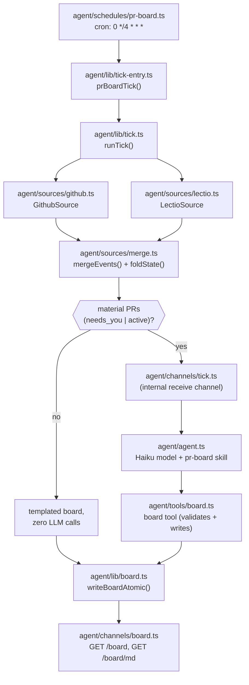

# Architecture

canonical-hours is a scheduled [eve.dev](https://eve.dev) agent: a
4-hour cron tick that fetches authored-PR activity from two sources,
merges and folds it into a four-state lifecycle, and — only when
something actually needs attention — invokes a Haiku model to triage
and write a status board. If you're trying to *run* it, start at
[../README.md](../README.md). This document covers what actually runs,
why it's built the way it is, and what's proven vs. still unverified.

## What runs



- **`agent/agent.ts`** — the standing agent definition: Haiku
  (`claude-haiku-4-5`) via the direct `@ai-sdk/anthropic` provider
  (bypassing Vercel AI Gateway), eve's default local/file workflow
  world, and a sandbox backend selected at runtime by
  `agent/sandbox.ts` (`SANDBOX_BACKEND=docker|vercel|auto`, env-driven
  so the same code runs against a local Docker daemon or Vercel
  Sandbox without a rebuild).
- **`agent/schedules/pr-board.ts`** — the cron entry point (`0 */4 * * *`).
  It does nothing but call `waitUntil(prBoardTick(...))`, forwarding the
  schedule handler's own `receive`/`appAuth`.
- **`agent/lib/tick.ts`** (`runTick`) — the deterministic core: fetch
  from every source independently, merge, fold, decide whether the tick
  is material, and either write a templated board directly or hand off
  to the agent. Never throws out of `runTick` itself — a failing source
  becomes a degradation entry, not a crash.
- **`agent/channels/tick.ts`** — an internal-only channel (`routes: []`,
  unreachable over HTTP) that exists solely so the tick can `receive()`
  the Haiku agent and *block until the agent's turn has actually
  settled* — it reads the session's event stream for
  `session.completed`/`session.failed` rather than trusting that
  `receive()`'s returned promise resolves at turn-completion (see
  `docs/eve-api-notes.md` fact 2 for why that trust would have been
  premature).
- **`agent/tools/board.ts`** — the only write surface the LLM has. It
  validates the model's board against the zod schema and stamps
  `generated_at` itself (never trusting the model's clock) before
  writing.
- **`agent/lib/board.ts`** — the board's zod contract
  (`BoardSchema`/`BoardPrSchema`), the markdown renderer, and
  `writeBoardAtomic()` (write-to-temp, then `rename` — a poll never
  observes a half-written `board.json`).
- **`agent/channels/board.ts`** — the read surface: `GET /board`
  (JSON) and `GET /board/md` (rendered markdown), both backed by
  `readBoard()`.

For the eve-specific API facts behind these choices (schedule/channel
shapes, the `receive()` blocking guarantee, sandbox backend imports,
the `/board` vs `/board.json` route-naming constraint), see
[eve-api-notes.md](eve-api-notes.md) — those are implementation
citations, not repeated here.

## The pluggable Source protocol

Before the tick, before the merge logic, there's a design decision that
shapes everything downstream: lectio and GitHub aren't hardcoded into
the pipeline, they're two implementations of one small interface
(`agent/sources/source.ts`). This was deliberate — the explicit ask
going in was "make it pluggable," scoped narrowly: a real interface
other adapters could implement, but *local to this repo*, not a
cross-project standard other repos are meant to adopt (that's a
possible future lectio enhancement, not this repo's job — see
`docs/lectio-api-notes.md`).

```ts
interface Source {
  name: string;
  schema: z.ZodType;                          // one raw provider record
  fetch(window: FetchWindow): Promise<unknown[]>;
  mapToLifecycleEvent(raw: unknown): LifecycleEvent;
  freshness(): Promise<string | null>;
}
```

Three things make this work as a real abstraction rather than a
thin wrapper around two special cases:

- **The shared vocabulary lives above the adapters, not inside them.**
  `Artifact` (a canonical URI + kind — `pr:owner/repo#123`), `Observation`
  (a timestamped fact with a `classification` of `hard` or `soft`), and
  the four-state `LifecycleState` enum (`opened` / `active` / `needs_you`
  / `resolved`) are all defined once, in `source.ts`, and every adapter
  normalizes into that shape. Nothing downstream of `mapToLifecycleEvent`
  ever sees a lectio- or GitHub-specific field.
- **Priority policy is a merge-time concern, not an adapter concern.**
  "GitHub is the sole hard source, lectio fills enrichment, hard beats
  soft on conflict" is a rule `agent/sources/merge.ts` applies across
  *whichever* sources are registered — it's not encoded in either
  adapter. `sources/lectio.ts` and `sources/github.ts` don't know about
  each other or their relative priority; they just each answer "what do
  you see, and how sure are you." That's what makes the earlier claim —
  "a third source later is a registry entry, not a rewrite" — actually
  true rather than aspirational: a hypothetical third adapter (Linear,
  say) would implement the same three methods, get added to the
  `priority` list `agent/lib/tick-entry.ts` passes into `runTick`, and
  everything from `mergeEvents` onward would handle it with zero
  changes.
- **Each adapter owns its own failure boundary.** `schema` is what makes
  "fail loudly, not silently" enforceable per-source: a provider
  response that doesn't parse throws inside that adapter's own
  `fetch`/`mapToLifecycleEvent`, gets caught by `runTick`'s per-source
  `try/catch`, and becomes one `degradations` entry — never a crash,
  never silent corruption of the merged view.

**Adding a new source** means: write a module implementing `Source`
(a zod schema for the provider's raw shape, a `fetch` that returns raw
records for a window, a `mapToLifecycleEvent` that normalizes into the
shared vocabulary, a `freshness` check), register it in the `priority`
array where lectio/GitHub are registered today, and — this is the part
that proves the abstraction — touch nothing in `merge.ts`, `board.ts`,
or `tick.ts`. If adding a source ever requires editing those files, the
abstraction has leaked and that's worth noticing, not working around.

The two live adapters are asymmetric on purpose, which is itself worth
understanding as a design choice rather than an inconsistency: lectio
(`sources/lectio.ts`) is soft-only — discovered mid-build that its
`memory_authored_activity` tool has no way to expose a review's verdict,
only that something happened (see `docs/lectio-api-notes.md`) — while
GitHub (`sources/github.ts`) is the sole producer of `hard`
classifications. A future adapter isn't obligated to pick a side; the
protocol doesn't care whether a source ever emits `hard` observations,
only that it's honest about which it's asserting.

## Data flow: one tick

1. **Fetch.** `runTick` calls `fetch(window)` on each configured
   `Source` (`agent/sources/source.ts`'s protocol) independently, inside
   its own try/catch. `window` is always `{ since: now - 72h, until:
   now }` — see [Why stateless](#why-stateless-a-72h-window-not-a-cursor)
   below. A source that throws becomes a `degradations` entry (with the
   *original* failure timestamp preserved across ticks via the previous
   board, not reset every 4 hours); it does not stop the other source or
   abort the tick.
2. **Normalize.** Each raw record is parsed against the adapter's own
   zod schema and mapped to a `LifecycleEvent` (one `Artifact` + its
   `Observation[]`). Schema drift throws loudly here, which becomes that
   source's degradation — not a silently wrong board.
3. **Merge + fold** (`agent/sources/merge.ts`). `mergeEvents()` dedupes
   observations across sources by canonical artifact URI
   (`pr:owner/repo#N`) under a priority list (`["lectio", "github"]`)
   with one override: **a hard observation always replaces a soft one**,
   regardless of source priority. `foldState()` then reduces one
   artifact's full observation history to a single lifecycle state —
   see [the worked example](#worked-example-one-pr-through-the-pipeline)
   below for the exact rule order.
4. **Decide materiality.** If no artifact folded to `needs_you` or
   `active`, the tick is a **quiet tick**: `runTick` writes a templated
   board directly (`tick_status: "all_clear"` or `"degraded"` if any
   source failed) and returns without ever invoking the LLM.
5. **Material tick.** Otherwise, `runTick` calls `invokeAgent()` (built
   by `createInvokeAgent` in `agent/lib/invoke-agent.ts`), which
   `receive()`s the merged material into the internal tick channel. The
   Haiku agent, guided by `agent/instructions.md` and the
   [`pr-board` skill](../agent/skills/pr-board/SKILL.md), triages and
   summarizes, then calls the `board` tool exactly once. `runTick`
   re-reads the board after the agent's turn settles; if it's not fresh
   (or the agent never produced a valid board), it retries once, then
   falls back to a deterministic degraded board carrying the
   un-summarized events — the LLM's absence degrades the *quality* of
   the board, never its existence.

## Design decisions

### Why GitHub is the sole hard-verdict source

This wasn't a design assumption — it was discovered mid-build via a
live MCP call and corrected. lectio's `memory_authored_activity` tool
projects each new item as `{ kind: "github/review" |
"github/review_comment", author, path, preview, observed_at_nanos }`.
`kind` names the *artifact type*, never the review's outcome. Reading
lectio's own adapter source (`gh.rs:394`) confirms the verdict
(`Approved` / `ChangesRequested` / `Commented`) *is* captured when
lectio ingests a review — but `authored.rs`'s projection into
`memory_authored_activity`'s response (lines 223–229) never forwards
it. There is no way, from this tool, to tell "approved" from "changes
requested" from "commented" — only "a review happened."

Consequently `agent/sources/lectio.ts`'s `classifyLectioKind()` is a
constant function: every lectio-sourced observation is `soft`, and
`mapToLifecycleEvent()` never claims a state stronger than `"active"`
(never `needs_you`, never `resolved`) on lectio's word alone.
`agent/sources/github.ts`, reading the same event straight from
GitHub's REST API (`GET /pulls/{n}/reviews`, which *does* return
`state`), classifies every observation it emits — review verdicts,
comments, merges, closes — as `hard`. The full citation trail (Rust
line numbers, the live call's raw JSON) is in
[lectio-api-notes.md](lectio-api-notes.md); this section is the "so
what," not the evidence.

The practical effect, enforced in `mergeEvents()`
(`agent/sources/merge.ts:104`): when lectio and GitHub both observe the
same event, a hard GitHub observation always overwrites a soft lectio
one at merge time, even though lectio is earlier in the source
priority list for *deduplication* purposes. Priority order picks a
winner among equal-classification duplicates; classification always
wins the state question.

### Why stateless: a 72h window, not a cursor

There is no persisted "last successfully processed" cursor anywhere in
this system. Every tick re-derives from scratch: a rolling 72-hour
lookback window (`agent/lib/tick.ts`, `windowHours` default 72) plus,
for GitHub specifically, a **current-state backstop** — a second query
(`state:open review:changes_requested`) for authored PRs the viewer
still owes a reply to, regardless of when the review landed
(`agent/sources/github.ts:130`, `fetch()`).

The backstop exists because the window alone isn't enough: a
`changes_requested` review from 4 days ago has aged out of any
72-hour lookback, but if you never replied, it should still be
`needs_you`. Cursor-based "new since last tick" tracking would need a
persisted cursor (a database, or at minimum a file the tick trusts
across restarts) and would need to handle cursor loss, cursor
corruption, and out-of-order delivery. The window+backstop approach
needs none of that: a lost tick, a redeployed process, or a crashed
run all self-heal on the next tick with no state to reconcile — the
board is a cache of a stateless recomputation, not the record of
truth. The tradeoff is explicit: an old `changes_requested` review that
GitHub's backstop query catches will surface even if you've since
scrolled past it in your own head; the system has no notion of "you
already saw this on the board," only "this is still true."

### Why the zero-LLM-call short-circuit

Every 4-hour tick invokes both sources regardless of whether anything
changed — that fetch/merge/fold work is cheap and deterministic. What's
*not* cheap, and not deterministic, is an LLM call. `runTick`'s
materiality check (step 4 above) is a plain boolean over the folded
states: any artifact at `needs_you` or `active`? If not, the tick
writes a templated `all_clear` (or `degraded`, if a source failed but
nothing material surfaced anyway) board via `toBoardPr()` and returns —
no model invocation, no token cost, no possibility of the LLM
hallucinating activity that didn't happen on a quiet tick. This also
means the *majority* of ticks in a typical week (most 4-hour windows on
a repo you're not actively getting reviewed on) cost nothing beyond two
API calls.

## Worked example: one PR through the pipeline

Trace a single PR, `owner/repo#123`, through one tick where Mark left a
`changes_requested` review 6 hours ago and you haven't replied:

1. **GitHub fetch.** `GithubSource.fetch()` finds `#123` in the
   `updated:>=` windowed search (and, since it has a standing
   `changes_requested`, in the backstop search too — the record is
   flagged `backstop: true`). `GithubSource.mapToLifecycleEvent()` reads
   `GET /pulls/123/reviews`, sees Mark's review with `state:
   "CHANGES_REQUESTED"`, and emits an `Observation`:
   ```
   { type: "review_changes_requested", author: "mark",
     classification: "hard", at: "<6h ago>" }
   ```
   Because the record came through the backstop query,
   `mapToLifecycleEvent` also sets `state_hint: "needs_you"`.
2. **lectio fetch (same tick).** If lectio also observed this review
   (its `gh` adapter ingested the same GitHub event), it emits its own
   `Observation` for the *same* underlying event —
   `{ type: "review", author: "mark", classification: "soft" }` — since
   lectio's `new_items[].kind` can only ever say "a review happened,"
   never its verdict.
3. **Merge** (`mergeEvents`). Both observations key to the same
   artifact URI (`pr:owner/repo#123`). If they collide on the same
   `(artifact_uri, at, author)` key, the hard GitHub observation wins
   outright per the hard-beats-soft override; if lectio's timestamp
   differs slightly, both survive as distinct entries in that artifact's
   observation list — either way, no soft observation ever suppresses
   the hard one.
4. **Fold** (`foldState`). Rule order: no hard `merge`/`close` exists
   (not resolved). The last hard verdict among
   `review_approved`/`review_changes_requested` is
   `review_changes_requested` → **`needs_you`**, before the function
   even reaches the "unanswered activity" or hint-based rules further
   down. (The backstop's `needs_you` hint would have reached the same
   conclusion independently, at rule 3, if the verdict rule hadn't
   already resolved it at rule 2 — belt and suspenders, not a
   coincidence: a GitHub-sourced `state_hint` and a GitHub-sourced hard
   verdict are reinforcing signals from the same source, not two
   independent opinions.)
5. **Board render.** `toBoardPr()` sets
   `reason: "unanswered review/comment or standing changes_requested"`.
   Because the tick now has at least one `needs_you` artifact, this is a
   **material tick**: the merged data (including this PR) goes to the
   Haiku agent, which — per `LIFECYCLE_SORT_ORDER` — renders `#123`
   *first* on the board, with a one-line concrete reason ("Mark's
   changes_requested has no reply") and, since it's a busy thread, a
   short summary. A quiet PR sitting at `active` with no unresolved
   verdict would render below it; anything `resolved` drops to the
   footnote line at the bottom.

## What's verified, and what's not

**Proven**, via `eve dev` and live-verified runs (see
[eve-api-notes.md](eve-api-notes.md) §3 for the exact commands and
output):

- The deterministic tick paths (all-clear and degraded-fallback) run
  end to end: a real tick fires, both sources fail gracefully against
  dummy credentials and are recorded as `degradations`, and
  `writeBoardAtomic()` writes a real `board/board.json` on the host
  filesystem.
- `POST /eve/v1/dev/schedules/pr-board` genuinely dispatches the cron
  schedule's `run()` handler through to a real `prBoardTick()` call.
- `GET /board` and `GET /board/md` serve the same file
  `writeBoardAtomic()` just wrote — confirmed by `curl` against a
  running `eve dev` instance, both the 200 (board exists) and 404
  (board doesn't exist yet) cases.
- Route-naming: dotted custom-channel paths (`/board.json`) fail the
  build outright (Nitro's static-asset interception); `/board` and
  `/board/md` do not. This shaped the actual route names in
  `agent/channels/board.ts`.

**Not yet verified — needs a real deployment:**

- **Whether the material path's board write lands on the same
  filesystem the tick/HTTP route reads from.** The deterministic paths
  use plain `node:fs` directly, with no sandbox indirection, and that's
  confirmed live. But the Haiku agent's own `board` tool call
  (`agent/tools/board.ts`) executes inside eve's own managed execution
  context for that agent turn — and if that context runs in a
  sandboxed filesystem (plausible given the sandbox-backend machinery
  in `agent/sandbox.ts`), its write could land somewhere `readBoard()`
  on the host never sees. This wouldn't crash anything — `runTick`'s
  retry would simply find no fresh board and fall through to the
  deterministic degraded-fallback board — but it would mean LLM
  summarization silently never takes effect in production. This needs
  a deploy-time smoke test: trigger a material tick, `curl /board` on
  the host, and confirm the LLM-authored `summary` field is actually
  present.
- **Concurrent-invocation safety in production.** The tick's overlap
  guard (`agent/lib/tick.ts`'s module-level `running` flag) is
  in-process only. It's what makes `writeBoardAtomic`'s
  temp-file-then-rename pattern safe against *this process's* own
  overlapping calls — verified by a test that races two `runTick()`
  calls against the same module instance. It provides no protection
  against genuinely concurrent invocations across separate processes,
  which is exactly the shape a production Vercel Cron misfire (or a
  redeploy racing a scheduled tick) could take. Untested because there
  is no deployment to test it against yet.
- **fly.io and Vercel deployment themselves.** Deliberately deferred —
  there is no CI workflow and no deployment configuration in this repo
  yet. Everything above has only ever been exercised against a local
  `eve dev` process with manually triggered ticks.

Tracked as beads (`rsry_bead_search` against this repo, not visible via
local `bd list` — see note below):

- `canonical-hours-3169e1` — the material-path filesystem question above.
- `canonical-hours-25ff14` — the in-process-only overlap guard above.
- `canonical-hours-f325c3` — a `merge.ts` regression test that doesn't
  actually exercise the bug it claims to guard against (currently
  unreachable via the real pipeline, so non-blocking).
- `canonical-hours-dc68b5` — a recurring false-positive IDE diagnostic
  ("Cannot find module") on freshly-created files during development;
  confirmed not a real bug, tracked so it doesn't get re-investigated.

(Aside for contributors: `bd list` in this repo currently reports zero
issues even though the beads above exist and are correctly scoped —
a known desync between local `bd` CLI and beads written via the `rsry`
MCP tooling. Use `rsry_bead_search`/`rsry_list_beads` against this repo,
not `bd`, until that's sorted out.)

## Future tooling: structural smell gate

This repo has no CI yet (see above), which is also the natural point to
wire in a structural-quality gate before one gets added ad hoc. The
sibling `agentic-research/mache` project ships `find-smells` — SQL rules
over a parsed-code database, a ratchet/baseline model (grandfather
existing debt, gate only on new debt), and a composite GitHub Action
that mache itself dogfoods. It's not TypeScript-specific; worth wiring
in alongside whatever CI workflow eventually lands here, rather than
retrofitting it after debt accumulates. See
`agentic-research/mache`'s `examples/smell-rules/README.md` for the
mechanics (rule format, baseline bootstrapping, the CI action) before
adding it.
